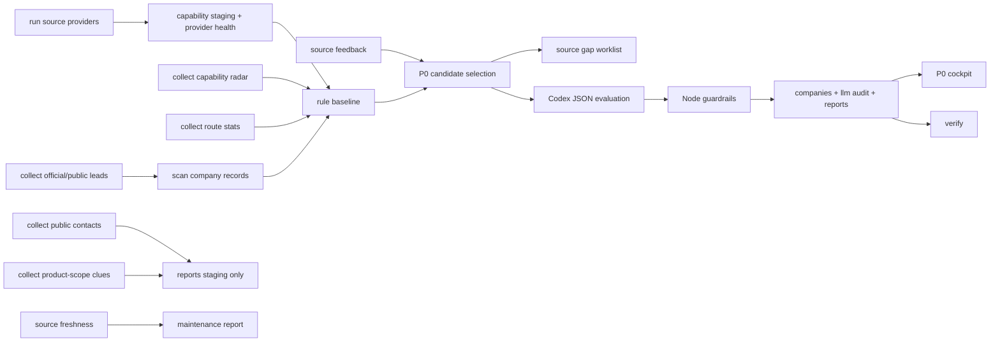

# Goods Radar Architecture

Goods Radar is a CLI-driven Agent product for South American omasum source radar work. It separates deterministic Node pipelines from constrained Codex judgment.

## Layers

- System layer: code, prompts, docs, tests, source providers, and command runner.
- User layer: mission config, source config, buyer profile, mutable data, reports, and staging outputs.

User-layer files remain local and are ignored by Git.

## Data Flow



## Guardrail Split

Node owns:

- deterministic scoring;
- candidate selection;
- evidence caps;
- D1 blocking;
- TSV headers and audit writes;
- staging contact boundaries;
- product-scope staging boundaries;
- source provider staging and provenance validation;
- source freshness and parser-maintenance reporting;
- negative sourcing feedback downranking;
- source gap worklists for contact, product-scope, current-batch, and feedback closure;
- verification.

Codex owns:

- qualitative sourcing diagnosis;
- P0 readiness reasoning;
- supplier-role classification;
- product/contact questions;
- A-G report prose.

Codex output is always constrained by Node before it can update audit rows.

## P0 Loop

P0 is a manual verification loop:

1. Identify official/capability/radar candidate.
2. Find public source access path or mark `contact_needed`.
3. Ask product-scope questions.
4. Ask contact/commercial/QC questions.
5. Capture current media or local verification.
6. Import reviewed artifacts through guarded data flows.

P0 is not supplier approval.

## Source Provider Contract

Providers live under `lib/sources/providers/`. A provider returns:

```js
{
  rows: [{ source_url: "https://...", ... }],
  health: { status: "ok", row_count: 1 }
}
```

Every row must include `source_url` or `url_or_file` provenance.

Run providers through:

```powershell
.\goods-radar.cmd source:providers
```

Provider output is staging only until a human-reviewed import path promotes it into user-layer data.
